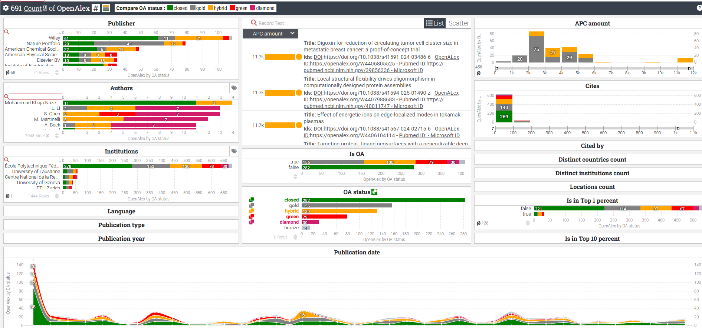

# OpenAlex Data Explorer

## Overview

The **OpenAlex Data Explorer** is a web application that allows users to explore and analyze data from the OpenAlex API. By entering a valid API URL, users can retrieve metadata about academic works, including bibliographic information, open access status, citation counts, and more. The application provides an interactive dashboard for visualizing relationships between various data points.

## Screenshot



## Features

- **API URL Input**: Enter a valid OpenAlex API URL to fetch data.
- **Data Validation**: Test the validity of the provided API URL before harvesting data.
- **Interactive Dashboard**: Visualize and explore relationships between authors, institutions, and works.
- **Polite Tool Compliance**: Use an email address for polite API requests to comply with OpenAlex's usage policies.

## Python Installation

To set up the OpenAlex Data Explorer locally, follow these steps:

1. **Clone the Repository**:
   ```bash
   git clone https://github.com/yourusername/openalex-data-explorer.git
   cd openalex-data-explorer
   ```

2. **Set Up a Virtual Environment** (optional but recommended):
   ```bash
   python -m venv venv
   source venv/bin/activate  # On Windows use `venv\Scripts\activate`
   ```

3. **Install Dependencies**:
   ```bash
   pip install -r requirements.txt
   ```

4. **Run the Application**:
   ```bash
   python app.py
   ```

5. **Access the Application**: Open your web browser and navigate to `http://127.0.0.1:5000`.

## Docker installation

 ```bash
git clone https://github.com/yourusername/openalex-data-explorer.git
cd openalex-data-explorer
```

```bash
docker build -t openalex-explorer:latest .
docker run -d --name openalex-explorer -p 5000:5000 -v $(pwd):/app openalex-explorer:latest
```

## Usage

1. **Enter API URL**: In the "OpenAlex API URL" field, input a valid OpenAlex API request URL.
2. **Email Address**: Provide an email address in the "Email address" field for polite tool compliance.
3. **Test URL**: Click the "Test API url" button to verify the validity of the URL.
4. **Explore Data**: After testing, click the "Explore" button to fetch and visualize the data in the dashboard.

## Example API URLs

- **Small set (~ 50 records)**:
  ```
  https://api.openalex.org/works?filter=authorships.institutions.lineage:i5124864,publication_year:2025,authorships.institutions.lineage:i35440088
  ```

- **Medium set (~ 700 records)**:
  ```
  https://api.openalex.org/works?page=1&filter=authorships.institutions.lineage:i5124864,publication_year:2025&sort=cited_by_count:desc&per_page=10
  ```
## Example processed data

The `static/data` folder contains a json example file `example_metadata.json` of harvested records after processing and ready for visualization.

## License

This project is licensed under the MIT License. See the [LICENSE](LICENSE) file for details.

## Contact

For any inquiries or support, please contact [grldn.geoffroy@gmail.com](mailto:grldn.geoffroy@gmail.com).